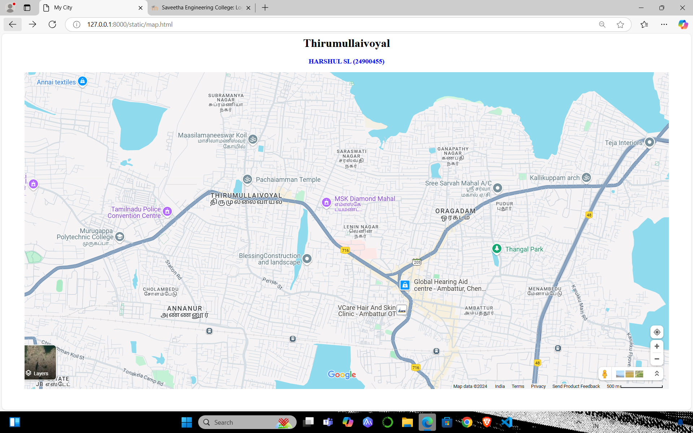
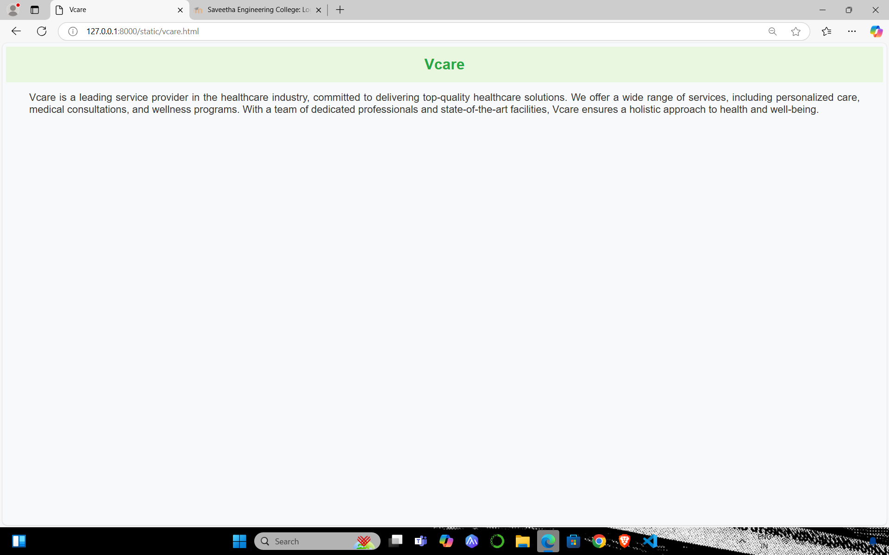
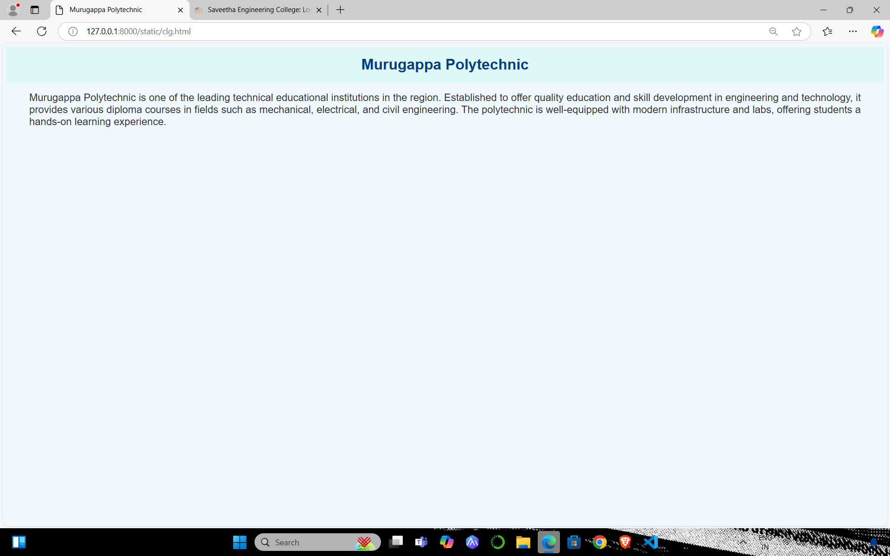
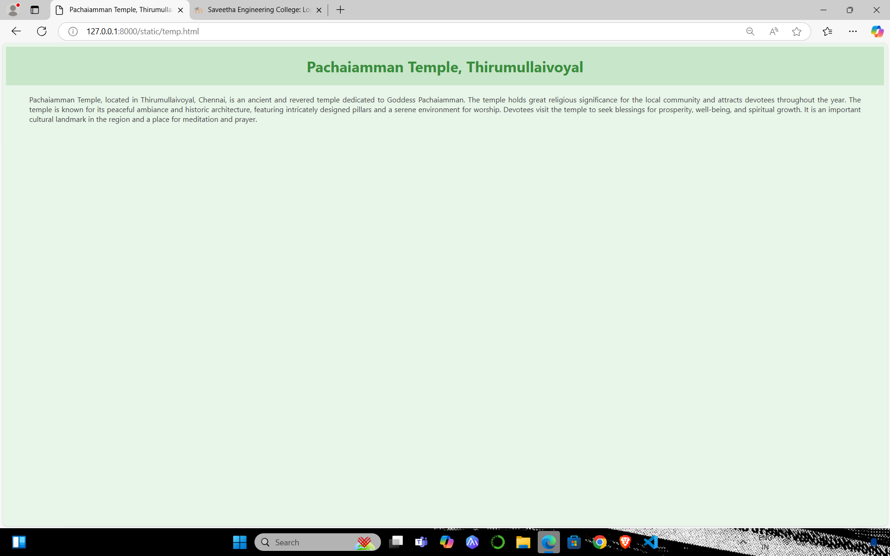

# Ex04 Places Around Me
## Date: 02/12/2024

## AIM
To develop a website to display details about the places around my house.

## DESIGN STEPS

### STEP 1
Create a Django admin interface.

### STEP 2
Download your city map from Google.

### STEP 3
Using ```<map>``` tag name the map.

### STEP 4
Create clickable regions in the image using ```<area>``` tag.

### STEP 5
Write HTML programs for all the regions identified.

### STEP 6
Execute the programs and publish them.

## CODE

```
<html>
<head>
<title>My City</title>
</head>
<body>
<h1 align="center">
<font color="black"><b>Thirumullaivoyal</b></font>
</h1>
<h3 align="center">
<font color="blue"><b>HARSHUL SL (24900455)</b></font>
</h3>
<center>


<map name="image-map">
    <area target="" alt="Pachaiamman Temple" title="Pachaiamman Temple" href="temp.html" coords="584,269,655,324" shape="rect">
    <area target="" alt="Murugappa Polytechnic" title="Murugappa Polytechnic" href="clg.html" coords="261,459,66" shape="circle">
    <area target="" alt="Thangal Park" title="Thangal Park" href="park.html" coords="1304,432,1337,471,1342,534,1276,525,1273,460" shape="poly">
    <area target="" alt="Vcare Hair and Skin Clinic" title="Vcare Hair and Skin Clinic" href="vcare.html" coords="1055,659,63" shape="circle">
    <area target="" alt="Msk Diamond Mahal" title="Msk Diamond Mahal" href="mahal.html" coords="771,338,1074,404" shape="rect">
</map>
</center>
</body>
</html>
```

## OUTPUT








## RESULT
The program for implementing image maps using HTML is executed successfully.
